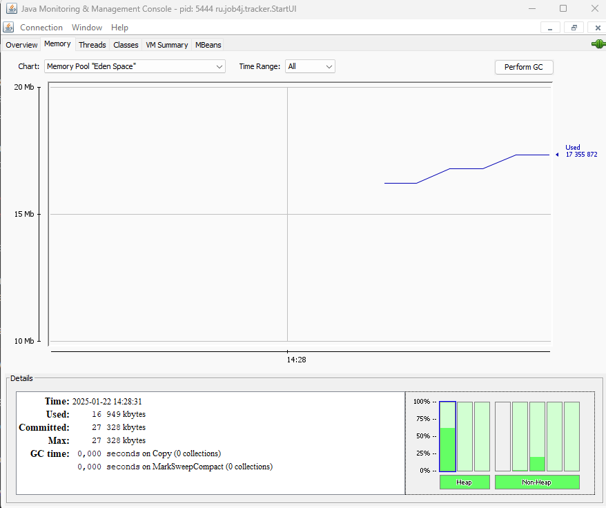
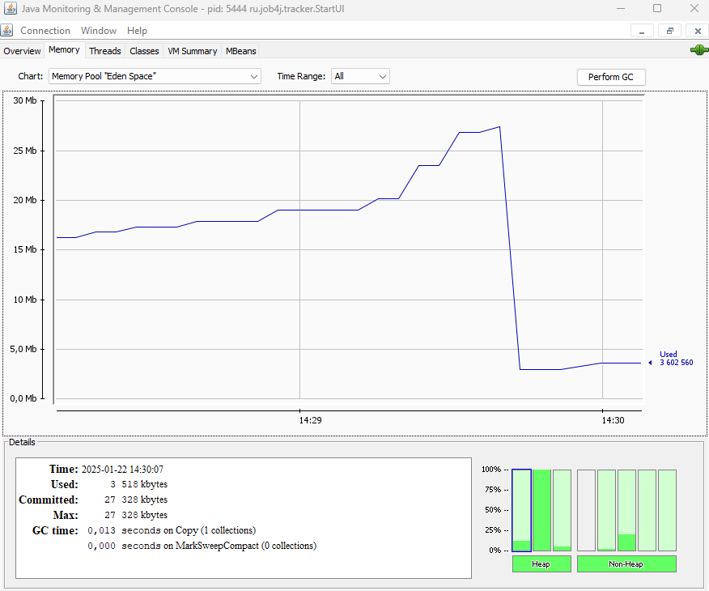
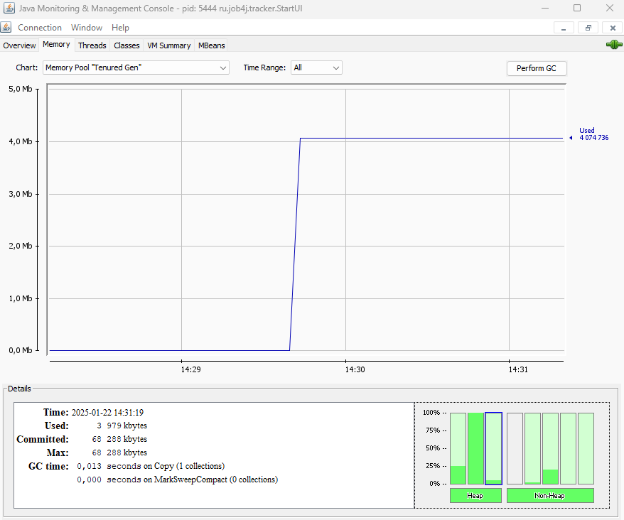
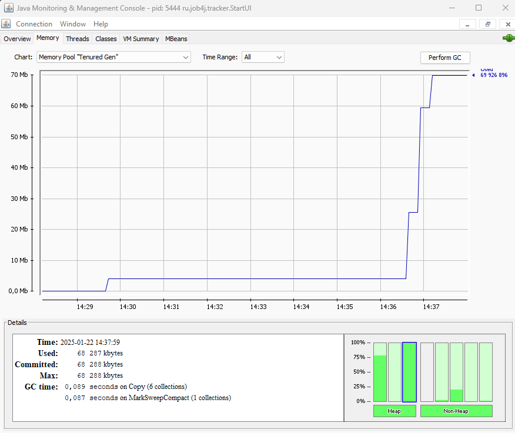
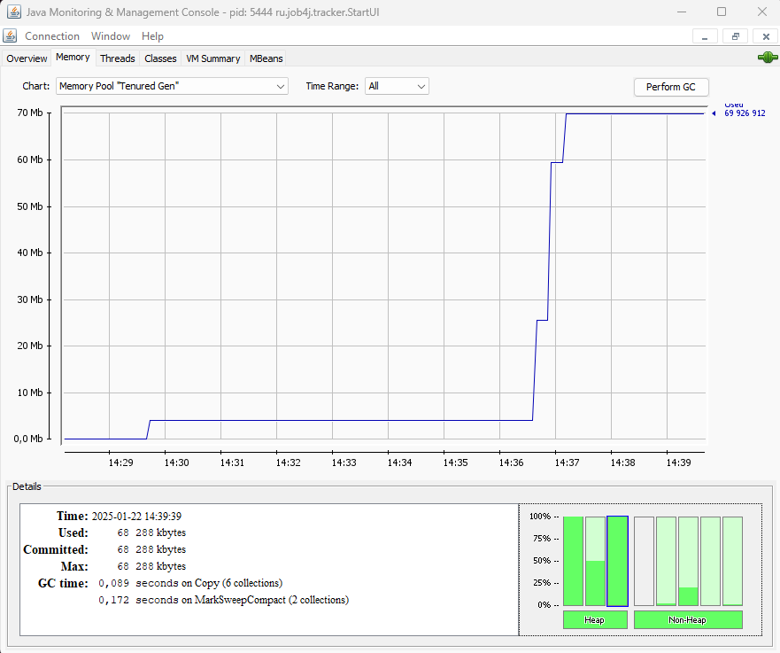
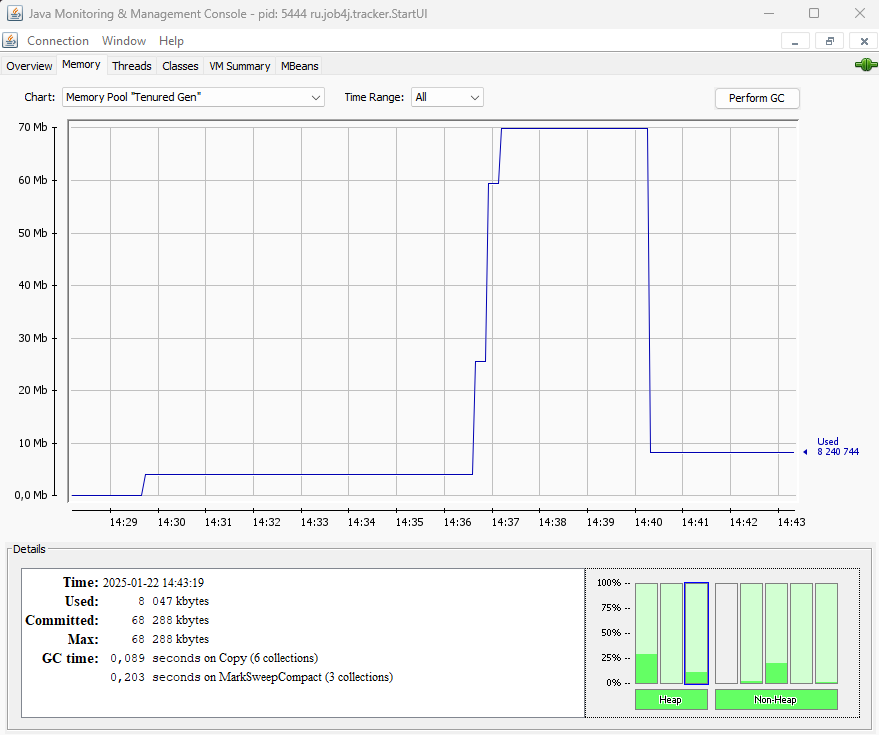
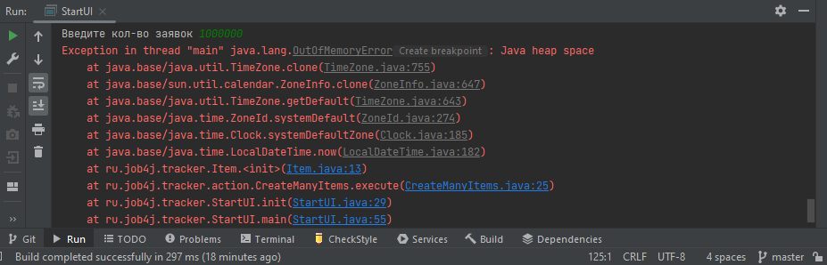

Работа GC тестировалась при помощи утилиты jconsole.
Запуск программы с ключом -XX:+UseSerialGC c ограничемнием heap минимум - 100мб, максимум -100 мб.
1. Начало работы программы:

Видно что заполнена незначительно только область Eden служебными объектами программы.
2. Добавыляем 100000 заявок:

Видно как срабатывает minorGC, объекты из области памяти Eden переходят в Survivor, и часть, после заполнения Survivor,
переходя в область памяти Old generation
3. Продолжим добавлять заявки:

После добавления 450000 заявок видно, как область памяти Old generation почти полностью заполнена
4. Удалим все заявки:

После удаления заявок GC не вступает в работу, Old generation по прежнему переполнена
5. Добавим еще немного заявок

Видно как срабатывает majorGC и область памяти Old generation очищается от ненужных объектов
6. Попробуем переполнить память

Программа заканчивает работу с OutOfMemoryError